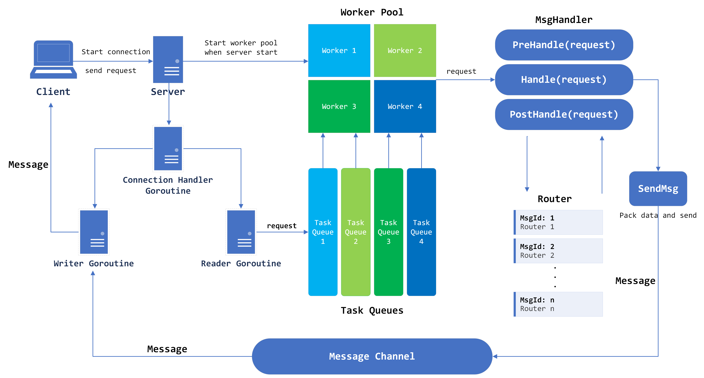
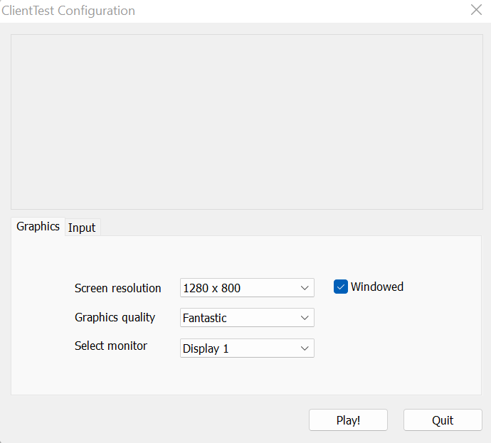
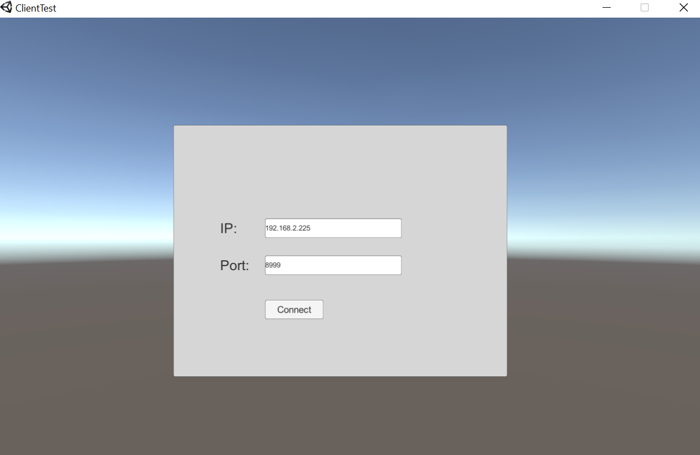
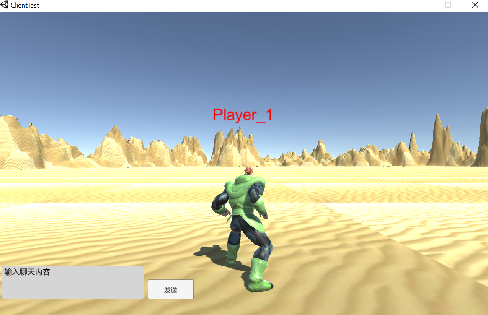
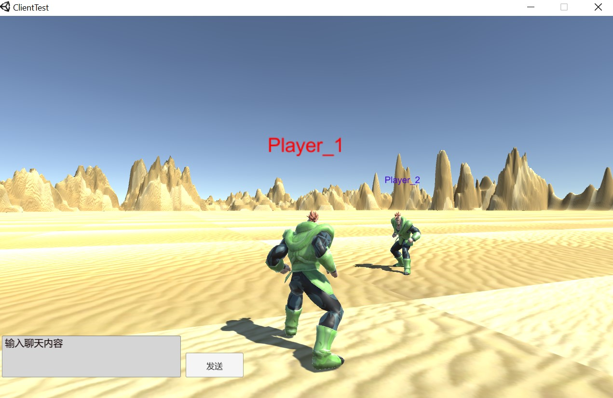

# Tigerkin
Tigerkin is a lightweight concurrent server framework based on Golang

## Main features
- Persistent connection based on TCP
- Work pool and task queue mechanism to support high concurrency requests
- Router mechanism to handle different requests
- Support global configuration
- Message packing and unpacking
- Read/write splitting model
- Connection management and property configuration

## Overall architecture


## Prerequisites
Set up Golang development environment, can refer to [Golang Install](https://golang.org/doc/install).

## Server
To develop a server application based on the Tigerkin framework, the main steps are relatively simple:

- Create a server handler
- Register connection callback function (optional)
- Configure custom routers
- Start the service

A simple example is as follows: (There also a example in the [examples folder](examples))
```go
func main() {
	// Create a server handler
	s := tnet.NewServer()

    // Register connection callback function (optional)
	s.SetOnConnStart(DoConnectionBegin)
	s.SetOnConnStop(DoConnectionLost)

	// Configure custom routers
	s.AddRouter(0, &PingRouter{})

	// Start the service
	s.Serve()
}
```

A custom router example is as follows:

```go
// Custom PingRouter
type PingRouter struct {
	tnet.BaseRouter
}

// PingRouter PreHandle
func (this *PingRouter) PreHandle(request tiface.IRequest) {
    // Some code ...
}

// PingRouter Handle
func (this *PingRouter) Handle(request tiface.IRequest) {

	fmt.Println("Call PingRouter Handle")
	fmt.Println("recv from client : msgId=", request.GetMsgID(), ", data=", string(request.GetData()))

	err := request.GetConnection().SendMsg(0, []byte("pong"))
	if err != nil {
		fmt.Println("SendMsg error: ", err)
	}
}

// PingRouter PostHandle
func (this *PingRouter) PostHandle(request tiface.IRequest) {
    // Some code ...
}
```

A connection callback function example is as follows:
```go
// Execute when creating a connection
func DoConnectionBegin(conn tiface.IConnection) {
	fmt.Println("DoConnecionBegin is Called ... ")

	// Set connection properties
	conn.SetProperty("Name", "Hou")
	conn.SetProperty("Home", "https://github.com/HOU-SZ")
	fmt.Println("Set Connection Name, Home done!")

	err := conn.SendMsg(2, []byte("DoConnection BEGIN..."))
	if err != nil {
		fmt.Println("Connection SendMsg msg error: ", err)
	}
}

// Execute before the connection ending
func DoConnectionLost(conn tiface.IConnection) {
	// Some custom code
	if name, err := conn.GetProperty("Name"); err == nil {
		fmt.Println("Connection Property Name = ", name)
	}

	if home, err := conn.GetProperty("Home"); err == nil {
		fmt.Println("Connection Property Home = ", home)
	}

	fmt.Println("DoConnectionLost is Called ... ")
}
```

Once the server starts successfully, the terminal will display the following information:
```bash

                😝 👻 🐯  𝓣𝓲𝓰𝓮𝓻𝓴𝓲𝓷  🐯 👻 😝

┌─────────────────────────────────────────────────────────────┐
│         [Github] https://github.com/HOU-SZ/tigerkin         │
└─────────────────────────────────────────────────────────────┘
[Tigerkin] Server name: Tigerkin server example, listen at IP: 127.0.0.1, Port 8999 is starting
[Tigerkin] Version: V0.11, MaxConn: 8, MaxPacketSize: 4096
[Tigerkin] Worker ID =  0  has started.
[Tigerkin] Worker ID =  1  has started.
[Tigerkin] Worker ID =  4  has started.
[Tigerkin] Worker ID =  3  has started.
[Tigerkin] Worker ID =  5  has started.
[Tigerkin] Worker ID =  6  has started.
[Tigerkin] Worker ID =  7  has started.
[Tigerkin] Worker ID =  2  has started.
[Tigerkin] Start Tigerkin server [ Tigerkin server example ] success, now listenning...
```

### Useful Module APIs for Server
* Server Module
```go
// Create a server handler
func NewServer() tiface.IServer

// Start the server
func (s *Server) Start()

// Stop the server
func (s *Server) Stop()

// Start the service
func (s *Server) Serve()

// Add a custom router
func (s *Server) AddRouter(msgId uint32, router tiface.IRouter) 

// Register connection callback function which executes when creating a connection
func (s *Server) SetOnConnStart(hookFunc func (tiface.IConnection))

// Register connection callback function which executes before the connection ending
func (s *Server) SetOnConnStop(hookFunc func (tiface.IConnection))
```
* Router Module
```go
// When implementing a custom router, first inherit the BaseRouter base class
// Then rewrite the methods of this base class as needed (similar to the implementation of the Beego framework)
type BaseRouter struct{}

// PreHandle method which executes before handling the main business logic (optional)
func (br *BaseRouter) PreHandle(req tiface.IRequest) {}

// Handle method to handle the main business logic
func (br *BaseRouter) Handle(req tiface.IRequest) {}

// PostHandle method which executes after handling the main business logic (optional)
func (br *BaseRouter) PostHandle(req tiface.IRequest) {}
```

* Connection Module
```go
// Get original socket TCP Connection
GetTCPConnection() *net.TCPConn

// Get current connection ID
GetConnID() uint32

// Get remote client address
RemoteAddr() net.Addr

// Send message to client (without buffer)
SendMsg(msgId uint32, data []byte) error

// Send message to client (with buffer)
SendBuffMsg(msgId uint32, data []byte) error

// Set connetion property by key and value
SetProperty(key string, value interface{})

// Get connetion property by key
GetProperty(key string) (interface{}, error)

// Remove connetion property by key
RemoveProperty(key string)
```

* Request Module
```go
// Get connection information of the request
func (r *Request) GetConnection() tiface.IConnection

// Get message data of the request
func (r *Request) GetData() []byte

// Get message ID of the request
func (r *Request) GetMsgID() uint32
```
## Client API
To develop a client application based on the Tigerkin framework, the example main steps are following:
- Dial the server application using the [net library](https://pkg.go.dev/net) and get the connection

- Create a message instance and pack the message using the [datapack module](tnet/datapack.go) provided by Tigerkin
- Send the packed message

- Read the head part from io stream, then unpack the head part to a message instance
- Read the data part from io stream according to the data length, and set the data part to the data field of the message instance

About sending, packing and unpacking message:

Since Tigerkin transmits data in the form of TCP stream, so we need to be able to distinguish between two consecutive messages. We adopt the classical [TLV format](https://en.wikipedia.org/wiki/Type%E2%80%93length%E2%80%93value) as our transmitted data format.

To send a message to server, we need first to creat a message instance by providing message id and content, then pack the message to a byte array to send.

To recieve a message from server, we need read and unpack the head part from the io stream, then get the data part length and receive the data part according to the length.

A simple example is as follows: (There also a example in the [examples folder](examples))
```go
package main
import (
	"fmt"
	"io"
	"net"
	"time"

	"github.com/HOU-SZ/tigerkin/tnet"
)

func main() {

	// Dial the server application and get the connection
	conn, err := net.Dial("tcp", "127.0.0.1:8999")
	if err != nil {
		fmt.Println("client start error, exit!")
		return
	}

	for {
		// Create a message instance and pack the message using the provided by Tigerkin
		dp := tnet.NewDataPack()
		msg, _ := dp.Pack(tnet.NewMsgPackage(0, []byte("Tigerkin client example test MsgID=0, [Ping]")))

		// Send the packed message
		_, err := conn.Write(msg)
		if err != nil {
			fmt.Println("write error: ", err)
			return
		}

		// Read the head part from io stream
		headData := make([]byte, dp.GetHeadLen())
		_, err = io.ReadFull(conn, headData)
		if err != nil {
			fmt.Println("read head error: ", err)
			break
		}

		// Unpack the head part to a message instance
		msgHead, err := dp.Unpack(headData)
		if err != nil {
			fmt.Println("server unpack error: ", err)
			return
		}

		if msgHead.GetDataLen() > 0 {
			// if the data part length > 0, then read the data part from the io stream
			msg := msgHead.(*tnet.Message)
			msg.Data = make([]byte, msg.GetDataLen())

			// Read the data part from io stream according to the data length, and set the data part to the data field of the message instance
			_, err := io.ReadFull(conn, msg.Data)
			if err != nil {
				fmt.Println("server unpack data error: ", err)
				return
			}

			fmt.Println("==> Test Router:[Ping] Recv Msg: ID=", msg.Id, ", len=", msg.DataLen, ", data=", string(msg.Data))
		}

		time.Sleep(1 * time.Second)
	}
}
```
### Useful Module APIs for Client
* Message Module
```go
// Create a new message instance
func NewMsgPackage(id uint32, data []byte) *Message

// Get message data length
func (msg *Message) GetDataLen() uint32

// Get message id
func (msg *Message) GetMsgId() uint32

// Get message data
func (msg *Message) GetData() []byte
```
* Datapack Module
```go
// Create a new datapack instance
func NewDataPack() *DataPack

// Get message head length
func (dp *DataPack) GetHeadLen() uint32

// Pack message to byte array
func (dp *DataPack) Pack(msg tiface.IMessage) ([]byte, error)

// Unpack byte array to message
func (dp *DataPack) Unpack(binaryData []byte) (tiface.IMessage, error)
```

## Configuration
All configuration items are as following, and can be set by a configuration file. 

- `Name`: Server Name
- `Host`: Server IP
- `TcpPort`: Server Port
- `MaxConn`: Maximum number of client connections allowed
- `WorkerPoolSize`: Maximum number of workers in the worker pool
- `MaxPacketSize`: Maximum size of every message packet
- `MaxWorkerTaskLen`: The maximum number of tasks in the message queue corresponding to each worker
- `MaxMsgChanLen`: Maximum buffer length for sending messages message to client with buffer

A simple example of a configuration file is as follows. Please place the configuration file in the conf path and name it tigerkin.json.
```json
{
    "Name": "Tigerkin server example",
    "Host": "127.0.0.1",
    "TcpPort": 8999,
    "MaxConn": 8,
    "WorkerPoolSize": 8
}
```

## Examples
### 1. Simple Ping-Pong Application
The code of the simple ping-pong application is in the [examples folder](examples)

#### Start the server
```bash
cd examples/server
go run main.go
```
Once the server starts successfully, the terminal will display the following information:
```bash

                😝 👻 🐯  𝓣𝓲𝓰𝓮𝓻𝓴𝓲𝓷  🐯 👻 😝

┌─────────────────────────────────────────────────────────────┐
│         [Github] https://github.com/HOU-SZ/tigerkin         │
└─────────────────────────────────────────────────────────────┘
[Tigerkin] Server name: Tigerkin server example, listen at IP: 127.0.0.1, Port 8999 is starting
[Tigerkin] Version: V0.11, MaxConn: 8, MaxPacketSize: 4096
[Tigerkin] Worker ID =  0  has started.
[Tigerkin] Worker ID =  1  has started.
[Tigerkin] Worker ID =  4  has started.
[Tigerkin] Worker ID =  3  has started.
[Tigerkin] Worker ID =  5  has started.
[Tigerkin] Worker ID =  6  has started.
[Tigerkin] Worker ID =  7  has started.
[Tigerkin] Worker ID =  2  has started.
[Tigerkin] Start Tigerkin server [ Tigerkin server example ] success, now listenning...
```

#### Start the client
```bash
cd examples/client
go run main.go
```

Once the client starts successfully, the client terminal will display corresponding log information:
```bash
==> Test Router:[Ping] Recv Msg: ID= 2 , len= 21 , data= DoConnection BEGIN...
==> Test Router:[Ping] Recv Msg: ID= 0 , len= 4 , data= pong
==> Test Router:[Ping] Recv Msg: ID= 0 , len= 4 , data= pong
==> Test Router:[Ping] Recv Msg: ID= 0 , len= 4 , data= pong
==> Test Router:[Ping] Recv Msg: ID= 0 , len= 4 , data= pong
...
```
The server terminal will also display corresponding log information:
```bash
Get client connection, remote address =  127.0.0.1:59414
connection with connID =  0 has been added to ConnManager successfully: conn num =  1
------Call onConnStart()------
DoConnecionBegin is Called ...
Set Connection Name, Home done!
[Writer Goroutine is running]
[Reader Goroutine is running]
Call PingRouter Handle
recv from client : msgId= 0 , data= Tigerkin client example test MsgID=0, [Ping]
Call PingRouter Handle
recv from client : msgId= 0 , data= Tigerkin client example test MsgID=0, [Ping]
Call PingRouter Handle
recv from client : msgId= 0 , data= Tigerkin client example test MsgID=0, [Ping]
Call PingRouter Handle
recv from client : msgId= 0 , data= Tigerkin client example test MsgID=0, [Ping]
...
```
### 2. Simple Massively Multiplayer Online (MMO) Game Application
The code of the simple mmo game application is in the [demo_app/mmo_game folder](demo_app/mmo_game). The server part of the application was written with the tigerkin framework. The client part of the application was written with the Unity framework. Funtions implemented by the game application includes: player online/offline, real-time moving, real-time chat. The data format of the communication between the client and the server is defined by the protobuf protocol.

#### Start the server
```bash
cd demo_app/mmo_game
go run server.go
```

Once the server starts successfully, the terminal will display the following information:
```bash

                😝 👻 🐯  𝓣𝓲𝓰𝓮𝓻𝓴𝓲𝓷  🐯 👻 😝

┌─────────────────────────────────────────────────────────────┐
│         [Github] https://github.com/HOU-SZ/tigerkin         │
└─────────────────────────────────────────────────────────────┘
[Tigerkin] Server name: MMO Game, listen at IP: 0.0.0.0, Port 8999 is starting
[Tigerkin] Version: V0.11, MaxConn: 100, MaxPacketSize: 4096
[Tigerkin] Worker ID =  0  has started.
[Tigerkin] Worker ID =  1  has started.
[Tigerkin] Worker ID =  3  has started.
[Tigerkin] Worker ID =  4  has started.
[Tigerkin] Worker ID =  2  has started.
[Tigerkin] Worker ID =  5  has started.
[Tigerkin] Worker ID =  6  has started.
[Tigerkin] Worker ID =  7  has started.
[Tigerkin] Start Tigerkin server [ MMO Game ] success, now listenning...
```

#### Start the client
```bash
cd demo_app/mmo_game/client
client.exe
```
The client will starts with the following window, click play! button:



Change IP and Port correspondingly, and click connect button:



When the following window appears, it means that the client has started successfully:



Next, start clients for other players.



Change the player's view: Click the right mouse button.

Move the player's position: Press down Ctrl+W/A/S/D.

Chat with other players: Text some messages and send.

The server terminal will also display corresponding log information:
```bash
Get client connection, remote address =  192.168.0.108:50360
connection with connID =  0 has been added to ConnManager successfully: conn num =  1
------Call onConnStart()------
[Writer Goroutine is running]
[Reader Goroutine is running]
=====> Player pidId =  1  arrived ====
Get client connection, remote address =  192.168.0.108:50371
connection with connID =  1 has been added to ConnManager successfully: conn num =  2
[Reader Goroutine is running]
------Call onConnStart()------
[Writer Goroutine is running]
=====> Player pidId =  2  arrived ====
```